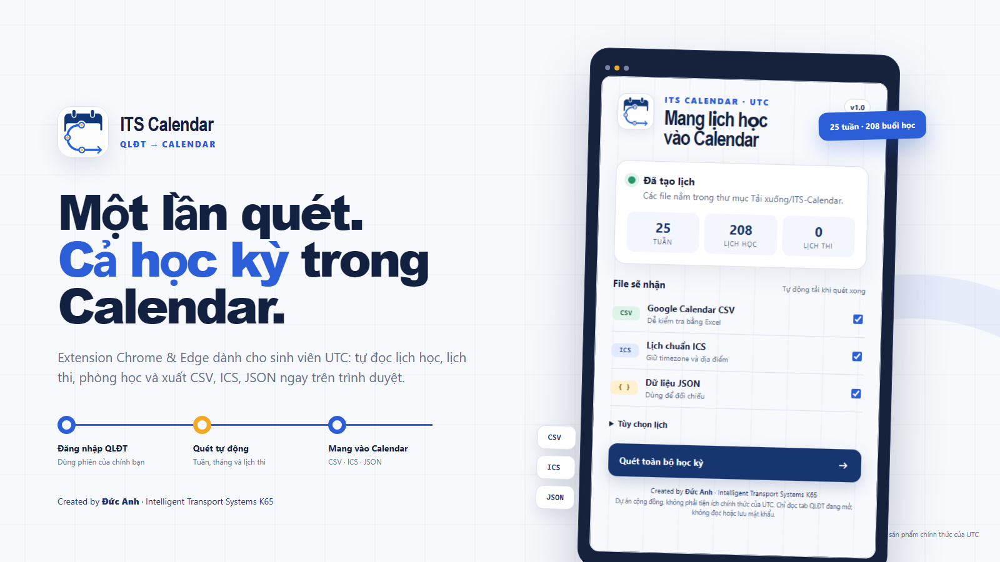
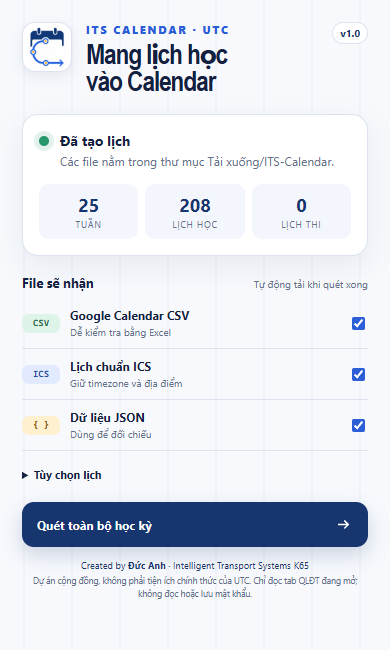

<p align="center">
  
</p>

<p align="center">
  <strong>Extension cộng đồng giúp sinh viên UTC đưa lịch học và lịch thi từ QLĐT vào Google Calendar.</strong><br>
  <sub>Quét tự động toàn học kỳ · Giữ phòng học và tiết học · Xử lý dữ liệu ngay trên thiết bị</sub>
</p>

<p align="center">
  <a href="https://github.com/Raindropdrops/ITS-Calendar-UTC/releases/latest/download/its-calendar-v1.0.1.zip"><strong>⬇ TẢI ITS CALENDAR v1.0.1</strong></a>
  &nbsp;·&nbsp;
  <a href="https://github.com/Raindropdrops/ITS-Calendar-UTC/releases/latest">Xem bản phát hành</a>
  &nbsp;·&nbsp;
  <a href="https://github.com/Raindropdrops/ITS-Calendar-UTC/issues">Báo lỗi</a>
</p>

<p align="center">
  
  
  
  
</p>

> [!IMPORTANT]
> Khi nhập lịch, chỉ dùng file **`utc_full_academic_calendar.ics`**. CSV là bản dự phòng để kiểm tra bằng Excel; không nhập cả CSV và ICS vào cùng một Calendar.

> [!NOTE]
> **v1.0.1** sửa lỗi một buổi học có thể xuất hiện hai lần do dữ liệu QLĐT được đọc từ hai nguồn, đồng thời giữ UID ổn định khi phòng học được bổ sung hoặc thay đổi.

## ITS Calendar là gì?

ITS Calendar là tiện ích mở rộng dành cho Chrome và Microsoft Edge. Sau khi bạn tự đăng nhập QLĐT UTC, tiện ích dùng chính tab đang mở để quét lịch học, lịch thi và tạo file nhập vào Calendar. Bạn không phải nhập lại tài khoản hoặc mật khẩu vào tiện ích.

Toàn bộ quá trình đọc và tạo lịch diễn ra ngay trong trình duyệt. ITS Calendar không gửi mật khẩu, cookie, phiên đăng nhập hoặc dữ liệu lịch của bạn đến máy chủ của tác giả.

### Tính năng

- Tự quét toàn bộ học kỳ, không phải chuyển từng tuần bằng tay.
- Chuyển tuần, chuyển tháng và tự xác định thời điểm nên dừng.
- Đọc lịch học, lịch thi, phòng học, mã lớp, tiết học và ghi chú.
- Giữ riêng các lớp thực tập không có giờ chi tiết, không tạo giờ học giả.
- Xuất ICS để nhập Calendar, CSV dự phòng và JSON để đối chiếu dữ liệu.
- Hiển thị phòng học ở cả trường `Location` và phần mô tả sự kiện.
- Chống trùng giữa dữ liệu nền của trang và card lịch đang hiển thị.
- Xử lý dữ liệu ngay trong trình duyệt; không gửi lịch lên máy chủ của tác giả.

## Cài đặt trong 3 bước

### 1. Tải extension

Nhấn nút **Tải ITS Calendar** phía trên hoặc mở [trang Releases](https://github.com/Raindropdrops/ITS-Calendar-UTC/releases/latest), sau đó tải file:

```text
its-calendar-v1.0.1.zip
```

Giải nén file ZIP trước khi cài.

### 2. Nạp extension

**Chrome:** mở `chrome://extensions`<br>
**Microsoft Edge:** mở `edge://extensions`

Sau đó:

1. Bật **Chế độ dành cho nhà phát triển**.
2. Chọn **Tải tiện ích đã giải nén** / **Load unpacked**.
3. Chọn đúng thư mục vừa giải nén.
4. Ghim biểu tượng **ITS Calendar** lên thanh công cụ.

### 3. Quét lịch

1. Đăng nhập tại [QLĐT UTC](https://qldt.utc.edu.vn/congthongtin/login.aspx#dashboard).
2. Mở **Tra cứu lịch → Lịch học**.
3. Bấm biểu tượng ITS Calendar.
4. Giữ lựa chọn **ICS** mặc định; CSV chỉ là bản dự phòng để mở bằng Excel.
5. Bấm **Quét toàn bộ học kỳ**.

Bạn có thể đóng popup trong lúc quét. Mở lại extension để xem tiến trình. Khi hoàn thành, các file nằm trong:

```text
Tải xuống/ITS-Calendar/
```

## Giao diện

<p align="center">
  
</p>

## Nên dùng file nào?

| File | Khi nên dùng |
|---|---|
| `utc_full_academic_calendar.ics` | Khuyên dùng để nhập lịch; giữ timezone, UID, phòng học và mô tả tốt nhất. |
| `utc_full_academic_calendar_google.csv` | Dễ mở bằng Excel và nhập dự phòng vào Google Calendar. |
| `utc_full_academic_calendar.normalized.json` | Đối chiếu dữ liệu đã quét và các lớp không có giờ chi tiết. |

> **Quan trọng:** Chỉ nhập **một** file lịch vào cùng một Calendar. Nên nhập file ICS. Không nhập thêm CSV sau đó vì CSV không có UID và Google Calendar sẽ tạo một bộ sự kiện thứ hai.

Mỗi buổi học được tạo thành một sự kiện riêng để phản ánh đúng tuần nghỉ, đổi phòng, lịch thực hành và lịch thi không đều.

## Quyền riêng tư và an toàn

ITS Calendar chỉ yêu cầu quyền cần thiết:

- Đọc trang `qldt.utc.edu.vn` khi người dùng chủ động chạy extension.
- Lưu trạng thái tiến trình cục bộ.
- Tạo file trong thư mục tải xuống.

Extension không đọc mật khẩu, không sao chép cookie, không bypass captcha và không gửi request chỉnh sửa dữ liệu QLĐT. Xem đầy đủ tại [Chính sách quyền riêng tư](PRIVACY.md).

## Câu hỏi thường gặp

<details>
<summary><strong>Vì sao lịch bị nhân đôi?</strong></summary>

Nguyên nhân thường gặp là đã nhập cả file ICS lẫn CSV, hoặc nhập lại một file CSV mới vào Calendar đã có lịch. Hãy tạo một Calendar riêng cho ITS Calendar, chỉ nhập file ICS và không nhập thêm CSV. Nếu lịch đã nhân đôi, cách sạch nhất là xóa Calendar phụ đó, tạo lại và nhập đúng một file ICS mới nhất.
</details>

<details>
<summary><strong>Vì sao Chrome yêu cầu bật Chế độ dành cho nhà phát triển?</strong></summary>

Phiên bản hiện tại được phân phối trực tiếp qua GitHub. Khi extension hoàn tất quy trình phát hành trên Chrome Web Store/Edge Add-ons, người dùng sẽ có thể cài bằng một nút mà không cần chế độ này.
</details>

<details>
<summary><strong>Lịch thi chưa xuất hiện thì sao?</strong></summary>

Extension chỉ có thể lấy dữ liệu nhà trường đã công bố. Hãy quét lại gần kỳ thi; ITS Calendar kiểm tra cả card thi trong trang Lịch học và trang Lịch thi riêng.
</details>

<details>
<summary><strong>Có dùng được trên điện thoại hoặc iOS không?</strong></summary>

Chưa. Phiên bản 1.0 tập trung vào Chrome và Edge trên máy tính. Giải pháp Android/iOS sẽ được nghiên cứu ở giai đoạn tiếp theo.
</details>

<details>
<summary><strong>Extension báo không tìm thấy lịch?</strong></summary>

Hãy tải lại trang QLĐT, mở đúng **Tra cứu lịch → Lịch học** và thử lại. Nếu lỗi vẫn còn, tạo [Issue mới](https://github.com/Raindropdrops/ITS-Calendar-UTC/issues/new/choose) kèm ảnh chụp màn hình, nhưng không đăng cookie, mật khẩu hoặc token.
</details>

## Dành cho nhà phát triển

Yêu cầu Node.js 22 trở lên:

```powershell
npm install
npm run check
npm run build:extension
```

Kết quả build:

```text
dist/extension/
dist/its-calendar-v1.0.1.zip
```

Phiên bản Playwright/CLI cũ vẫn được giữ để discovery endpoint, chẩn đoán khi QLĐT thay đổi giao diện và làm phương án dự phòng:

```powershell
npm run discover
npm run export
```

## Tác giả

**Đức Anh**<br>
Intelligent Transport Systems K65 · Hệ thống giao thông thông minh

Logo ITS Calendar kết hợp trang lịch với một tuyến giao thông thông minh: các điểm dừng tượng trưng cho từng buổi học và mũi tên thể hiện hành trình từ QLĐT tới Calendar.

Nếu dự án hữu ích, bạn có thể ⭐ repository và chia sẻ đường dẫn bản phát hành cho các sinh viên khác.

## Lưu ý

ITS Calendar là dự án cộng đồng độc lập, không phải sản phẩm chính thức và không đại diện cho Trường Đại học Giao thông Vận tải. Người dùng chịu trách nhiệm kiểm tra lịch sau khi nhập và tuân thủ quy định sử dụng hệ thống của nhà trường.

Phát hành theo [MIT License](LICENSE).
